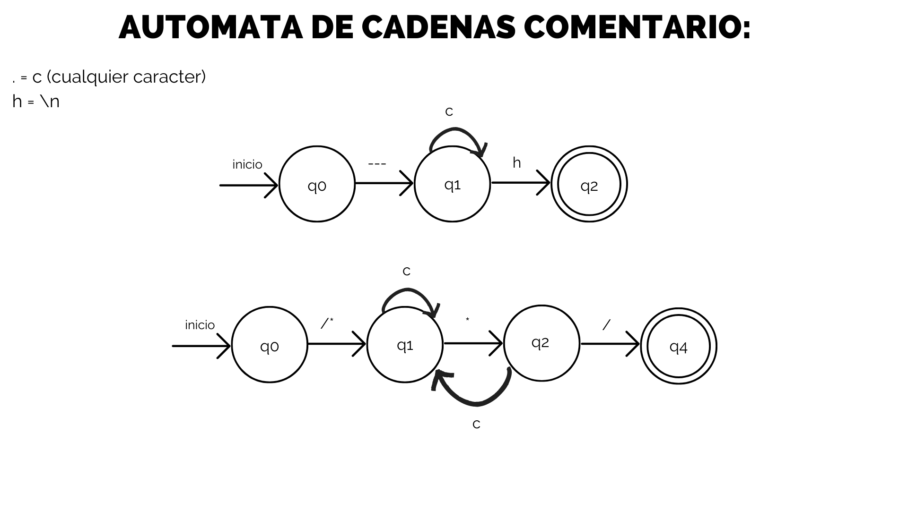

Miguel Angel Estrada Cifuentes.<br>
Lab Lenguajes Formales y de Programación Seccion B+. <br>
Carnet: 201907884.

---------------------------------------------------------------------------------
<center>

# Manual Tecnico
</center>

## Introduccion:

 El propósito del siguiente manual es describir toda la tecnología que fue utilizada en el desarrollo del segundo proyecto del laboratorio de LFP, tiene como objetivo documentar toda la funcionalidad y aspectos que utiliza la app referentes al frontend y el backend de la misma.


## Especificaciones tecnicas:

 <ol>
 <li>Desarrollado en python version 3.11.2</li>
 <li>Sistema operativo windows 10</li>
 <li>Librerias utilizadas: tkinter, os
 </ol>

 ### Archivos utilizados:
  - inicio.py
  - analizadores.py
  - interfaz.py
 
 ### Carpeta clases:
  - clasesP.py

# Descripcion de la aplicacion:

 ## inicio.py:
  Este archivo arranca la aplicacion, mostrando en frontend y empezando los procesos

 ```python
    app = Ventana()
    app.Ventana.mainloop()
 ```
  app es una instancia de ventana, importada desde interfaz.py
  el metodo mainloop arranca la interfaz para que el usuario pueda interactuar con ella 
  
## interfaz.py
 Este archivo contiene la interfaz grafica como tal, todo lo que la constituye y la interacción general con el usuario.
 ### Funcionalidad:

 - #### Clase VentanaInicial:
    El objeto ventana que usa las funciones de la libreria tkinter nativa de python
    la clase contiene todos los atributos del programa.

    Como la clase no hereda directamente de tk, al programa se le indica que la ventana como tal sera un objeto de tipo tk();
    
    ```
                    self.ventana = Tk()
    ```

 - ### AbrirArchivo():
    Cuando el botón abrir archivo es presionado se abre otra ventana auxiliar en la que se podrán abrir archivos de extension txt, json y lfp, luego se muestra el contenido en un text area, si se vuelve a presionar el boton y existe contenido en el text area, este se eliminara y reemplazara por el nuevo contenido

 - ### GuardarArchivo():
    Cuando el botón guardar archivo es presionado se abre otra ventana auxiliar en la que se podrán guardar archivos de extension txt, json y lfp, no borra nada del contenido del text area, solo guarda el contenido en un archivo con el nombre que el usuario le de

 - ### AnalizarArchivo():
    Invoca las funciones del archivo analizadores.py, el texto recién ingresado en la caja se analizara de acuerdo a si es parte del lenguaje de los archivos o no, si la caja no contiene nada, la aplicacion notificara al usuario

 - ### LimpiarCajaDeTexto():
    Limpia el contenido de la caja de texto, si hay contenido en la caja, se preguntara si se desea eliminar
    antes de ser guardado

 - ### cerrarApp():
    Cierra la aplicacion, termina toda la ejecucion del programa

 - ### dialogAnalizador():
    es el cuadro de dialogo que se muestra si la caja de contenido de entrada no tiene nada dentro de ella

 - ### escribirArchivo():
    Metodo que escribe el contenido de la caja de texto en un archivo de texto plano, si el archivo ya existe, se sobreescribe en el mismo archivo

 - ### outPutComandosYArchivo():
    Escribe los comandos en la caja de texto de salida, se actualiza por cada analisis

 - ### cerrarVenTokens():
    Cierra la ventana de tokens, regresa a la ventana principal

 - ### cerrarVenErrores():
    Cierra la ventana de Errores, regresa a la ventana principal
    
 - ### VentVerTokens():
    Crea la ventana de tokens, muestra los tokens en un widget de tkinter llamado treeview que es una tabla, se actualiza por cada analisis

 - ### VentVerErrores():
    Crea la ventana de tokens, muestra los errores, ya sean lexicos o sintacticos en un widget de tkinter llamado treeview que es una tabla, se actualiza por cada analisis

 - ### Elementos de la Ventana:
    - #### Botones:
        - Abrir
        - Guardar
        - Analizar
        - Limpiar
        - Salir
        - Errores
        - Tokens
    - #### Caja de texto:
        - Entrada
        - Salida

## Analizadores.py:
 Este archivo contiene el analizador lexico y sintactico
 ### Importaciones:
    from clases.clasesP import *

 ### Funcionalidad:
 - Variables Importantes:
    - global linea: la linea que se cuenta en la cadena de entrada
    - global columna: la columna que se cuenta en la linea de entrada
    - global lexema:  variable en la que se almacena un lexema identificado
    - global listaComandos: una lista de instrucciones con objetos de la clase lexema
    - global listaParaListaDeComandos: lista que almacena los objetos de la clase lexema hasta encontrar un punto y coma, luego se vacia para obtener otro comando

    - global listaOtrosLexemas: lista de lexemas de longitud 1 (caracteres reconocidos validos)

    - global listaErrores: lista de  objetos errores lexicos puede ser tanto lexicos como sintacticos

    - global listaReservadas: lista de lexemas de palabras reservadas

    - global listaGeneral: lista de lexemas de palabras reservadas y otros lexemas, se utiliza para ver los lexemas en una tabla

    - global listaMongoDB: lista de comandos de salida para mongoDB

 - ### get_key(lexema):
    Recibe de parametro un lexema, retorna el token del lexema dentro del diccionario de reservadas

 - ### ImprimirTodo():
    Imprime en consola todos los lexemas reconocidos

 - ### obtenerComentarioMultilinea(string):
    Recibe de parametro un string, retorna un lexema de tipo comentario multilinea, si no se cierra el comentario, no toma valores

 - ### obtenerComentarioUnilinea(string):
    Recibe de parametro un string, retorna un lexema de tipo comentario unilinea, cuando encuentra un salto de linea, se obtiene el comentario

 - ### obtenerLexemaPalabra(string):
    Recibe de parametro un string, retorna un lexema de tipo palabra, obtiene identificadores y palabras reservadas

 - ### obtenerLexemaParametro(string):
    Si en la lectura hay unas comillas se ejecutara; Recibe de parametro un string, retorna un lexema de tipo parametro, obtiene parametros de comandos y tambien json

 - ### VerComandos() 
    Este comando es el que comienza con el analisis sintactactico de los comandos, se encarga de ir comando por comando hasta que ya no existe ninguno que analizar

    Revisa la lista de listas (ListaComandos) si no hay ningun comando, el programa hara un return y terminara el analisis

    se le hace un pop al primer comando de la lista, luego revisa cual es su primer lexema y si entra dentro de los lexemas admitidos, entonces se ejecuta el analisis sintactico de ese comando
    sino simplemente lo tomara como un comando invalido

 - ### LecturaLexemas(string):
    Recibe de parametro un string, retorna una lista de objetos lexema, se encarga de leer caracter por caracter y analizarlo, si es un lexema valido, lo agrega a la lista de lexemas, sino lo agrega a la lista de errores, es el ciclo principal del cual se generan todos los demas subciclos, este proceso es el primero en ejecutarse, luego se ejecuta el analisis sintactico


*El analisis sintactico es por comando, se presenta a continuacion:*

-----------------------------------------------------------
  ## Comandos sin parametros
-----------------------------------------------------------
 - ### analizarCrearBD(comando):
    Recibe de parametro un comando, comando es una lista de objetos lexema, si el comando esta en orden y completo, obtiene el comando crear base de datos y lo agrega a la listaMongoDB para su posterior salida

 - ### analizarEliminarBD(comando):
    Recibe de parametro un comando, comando es una lista de objetos lexema, si el comando esta en orden y completo, obtiene el comando eliminar base de datos y lo agrega a la listaMongoDB para su posterior salida
-----------------------------------------------------------
  ## Comandos con un parametro
-----------------------------------------------------------
 - ### analizarCrearColeccion(comando):
    Recibe de parametro un comando, comando es una lista de objetos lexema, si el comando esta en orden y completo, obtiene el comando crear coleccion y lo agrega a la listaMongoDB para su posterior salida

 - ### analizarEliminarColeccion(comando):
    Recibe de parametro un comando, comando es una lista de objetos lexema, si el comando esta en orden y completo, obtiene el comando eliminar coleccion y lo agrega a la listaMongoDB para su posterior salida

 - ### analizarBuscarUnico(comando):
    Recibe de parametro un comando, comando es una lista de objetos lexema, si el comando esta en orden y completo, obtiene el comando buscar unico y lo agrega a la listaMongoDB para su posterior salida

 - ### analizarBuscarTodos(comando):
    Recibe de parametro un comando, comando es una lista de objetos lexema, si el comando esta en orden y completo, obtiene el comando buscar todos y lo agrega a la listaMongoDB para su posterior salida
-----------------------------------------------------------
 ## Comandos con dos parametros
-----------------------------------------------------------
 - ### analizarInsertarUnico(comando):
    Recibe de parametro un comando, comando es una lista de objetos lexema, si el comando esta en orden y completo, obtiene el comando insertar unico y lo agrega a la listaMongoDB para su posterior salida

 - ### analizarActualizarUnico(comando):
    Recibe de parametro un comando, comando es una lista de objetos lexema, si el comando esta en orden y completo, obtiene el comando actualizar unico y lo agrega a la listaMongoDB para su posterior salida

 - ### analizarEliminarUnico(comando):
    Recibe de parametro un comando, comando es una lista de objetos lexema, si el comando esta en orden y completo, obtiene el comando eliminar unico y lo agrega a la listaMongoDB para su posterior salida


# Carpeta Clases

## ClasesP.py:
 Este archivo contiene las clases que se utilizan en el programa, las clases son lexema y error
 ### Importaciones:
        none
    
 ### Funcionalidad:
 - ### Clase lexema:
    Esta clase se encarga de almacenar los lexemas reconocidos, se almacena el lexema, el token, la fila y la columna en la que se encuentra el lexema
   ```python
    class Lexema:
    def __init__(self, lexema, token, fila, columna):
        self.lexema = lexema
        self.token = token
        self.fila = fila
        self.columna = columna

    def __str__(self): # Para imprimir el objeto
        return str(self.lexema) + " " + str(self.tipo) + " " + str(self.fila) + " " + str(self.columna)

    def getLexema(self):
        return self.lexema

    def getToken(self):
        return self.token

    def getFila(self):
        return self.fila

    def getColumna(self):
        return self.columna
    ```

 - ### Clase error:
    Esta clase se encarga de almacenar los errores lexicos y sintacticos, se almacena el lexema, el token, la fila y la columna en la que se encuentra el lexema
   ```python
    class Error:
     def __init__(self,lexema, tipo, fila, columna, descripcion):
        self.lexema = lexema
        self.tipo = tipo
        self.fila = fila
        self.columna = columna
        self.descripcion = descripcion
    
    def getError(self):
        return str(self.lexema) + " " + str(self.tipo) + " " + str(self.fila) + " " + str(self.columna) + " " + str(self.descripcion)
    
    def getLexema(self):
        return self.lexema

    def getTipo(self):
        return self.tipo

    def getFila(self):
        return self.fila

    def getColumna(self):
        return self.columna
    
    def getDescripcion(self):
        return self.descripcion
    ```
                
<center>

# Tabla de tokens

| Token | Descripcion | Patron |
| --- | --- | --- |
| COMENTARIO-MULTILINEA | Comentario multilinea | /* . */ |
| COMENTARIO-UNILINEA | Comentario unilinea | ---. |
| CREAR-BD | Palabra reservada CrearBD | CrearBD |
| ELIMINARBD | Palabra reservada EliminarBD | EliminarBD |
| CREARCOLECCION | Palabra reservada CrearColeccion | CrearColeccion |
| ELIMINARCOLECCION | Palabra reservada EliminarColeccion | EliminarColeccion |
| INSERTARUNICO | Palabra reservada InsertarUnico | InsertarUnico | 
| ACTUALIZARUNICO | Palabra reservada ActualizarUnico | ActualizarUnico |
| ELIMINARUNICO | Palabra reservada EliminarUnico | EliminarUnico |
| BUSCARUNICO | Palabra reservada BuscarUnico | BuscarUnico |
| BUSCARTODO | Palabra reservada BuscarTodo | BuscarTodo |
| NUEVA | Palabra reservada nueva | nueva |
| IDENTIFICADOR | Identificador | [a-zA-Z][a-zA-Z0-9-_]* |
| PARIZQ | Parentesis izquierdo | ( |
| PARDER | Parentesis derecho | ) |
| COMA | Caracter Coma | , |
| PARAMETRO-NOMBRE | Parametro nombre |  [a-zA-Z][a-zA-Z0-9-_]* |
| PARAMETRO-JSON | Parametro JSON | { . } |
| PUNTO-COMA | Caracter punto y coma | ; |
| COMILLAS | Caracter comillas | " |


# Automata del analisis lexico
*En estas imagenes a continuacion estan los Automatas del analizador lexico*


# Automatas de los comentarios


# Automatas de los identificadores


# Automatas de los parametros


# Gramatica utilizada en el analizador sintactico
</center>


    ´´´
    init            : Instrucciones

    Instrucciones   : Instruccion Instrucciones
                    | Instruccion

    Instruccion     : CrearBD ;
                    | EliminarBD ;
                    | CrearColeccion ;
                    | EliminarColeccion ;
                    | InsertarUnico ; 
                    | ActualizarUnico ;
                    | EliminarUnico ;
                    | BuscarUnico ;
                    | BuscarTodo ;

    CrearBD           : CrearBD identificador = nueva CrearBD ( ) 
    EliminarBD        | EliminarBD identificador = nueva EliminarBD ( )
    CrearColeccion    | CrearColeccion identificador = nueva CrearColeccion ( " parametroNombre " )
    EliminarColeccion | EliminarColeccion identificador = nueva EliminarColeccion ( " parametroNombre " )
    InsertarUnico     | InsertarUnico identificador = nueva InsertarUnico ( " parametroNombre " , " parametroJSON " )
    ActualizarUnico   | ActualizarUnico identificador = nueva ActualizarUnico ( " parametroNombre " , " parametroJSON " )
    EliminarUnico     | EliminarUnico identificador = nueva EliminarUnico ( " parametroNombre " , " parametroJSON " )
    BuscarUnico       | BuscarUnico identificador = nueva BuscarUnico ( " parametroNombre " )
    BuscarTodo        | BuscarTodo identificador = nueva BuscarTodo ( " parametroNombre " )

    ´´´


